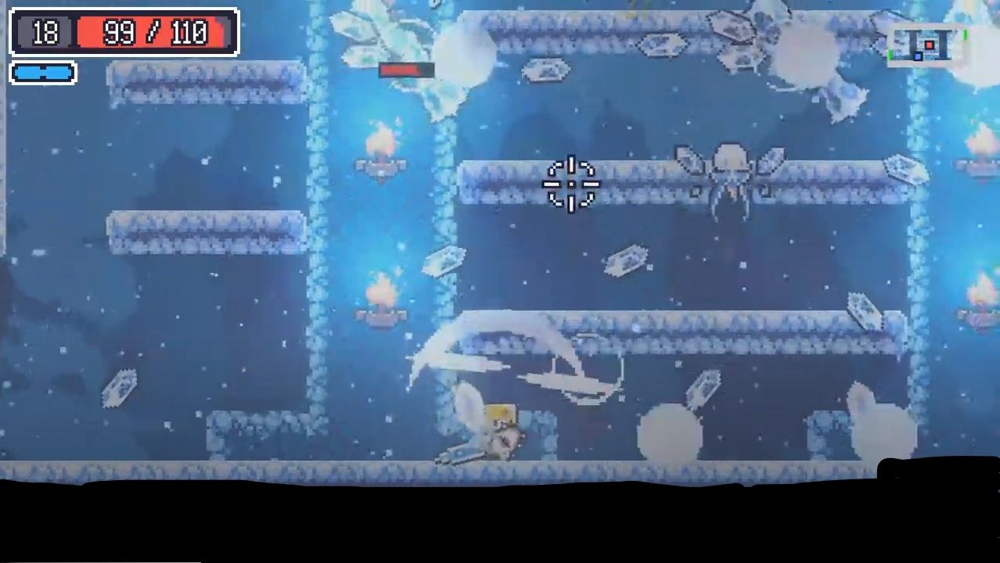

# [ 목차 ]

### 1. [게임명: Seven sins](#0)
### 2. [컨셉](#1)
### 3. [관련 동영상](#2)
### 4. [대표 이미지](#3)
### 5. [컨셉과 대표이미지 기반 작품 묘사](#3-1)
### 6. [Senven sins의 구성 요소](#4)
### 7. [게임 시스템 디자인](#5)
#### &nbsp;&nbsp;&nbsp;&nbsp; a. [게임 오브젝트 분해](#5-1)
#### &nbsp;&nbsp;&nbsp;&nbsp; b. [파라미터(속성)](#5-2)
#### &nbsp;&nbsp;&nbsp;&nbsp; c. [행동](#5-3)
#### &nbsp;&nbsp;&nbsp;&nbsp; d. [상태](#5-4)
#### &nbsp;&nbsp;&nbsp;&nbsp; e. [플레이어 캐릭터 속성(파라미터)](#5-5)
#### &nbsp;&nbsp;&nbsp;&nbsp; f. [게임의 규칙](#5-6)
#### &nbsp;&nbsp;&nbsp;&nbsp; g. [게임에서 사용될 공식](#5-7)
### 8. [개발 요구사항 & 흐름도](#6)
#### &nbsp;&nbsp;&nbsp;&nbsp; a. [요구사항(1년)](#6-1-1)
#### &nbsp;&nbsp;&nbsp;&nbsp; b. [요구사항(6주)](#6-1-2)
#### &nbsp;&nbsp;&nbsp;&nbsp; c. [키보드 이벤트에 대한 흐름도](#6-2)
### 9. [개발작업 일정(6주)](#7)

# 프로젝트명: seven sins (양승필) 
  

# [컨셉] 

## 메인컨셉 :

- 긴박함, 스릴

### 서브 컨셉 1 :

- 난이도 (쉬운 난이도의 게임은 금방 흥미를 잃고 긴박함도 줄 수 없기 때문에 쉽게 깨기 힘든 난이도로 설정 )

### 서브 컨셉 2 :

- 오브젝트 (아이템, 오브젝트 등을 활용해 난이도 조절과 단조로움을 최소화)

### 서브 컨셉 3 :

- 속도 (느린 속도로는 긴박함을 주기 힘듦, 빠른 속도감을 연출해 보다 스릴있게 함)

### 서브 컨셉 4 :

- 소리 (긴장감 있는 배경음악과 효과음으로 집중도를 높인다.)

### 서브 컨셉 5 :

- 타격감 (타격과 피격 등에 시각적인 이펙트로 맛있는 타격감을 준다)

  

# [관련 이미지 & 동영상] 

- 이미지  
  
- 동영상
  

  

# [대표 이미지] 

  

# [컨셉 & 대표이미지 기반 작품묘사] 

> ### 대표이미지 기반 :
(UI) 적의 공격이 잘 보이도록 오른쪽 위에 현재 스테이지와 키에 대한 설명을 제외하곤 UI 최소화 예정입니다. 긴장감을 주기 위해 적의 체력 상황을 보여주지 않습니다.

(배경) 1.처음에는 빛 한 점 없는 까만 배경이지만 다음 스테이지로 갈수록 점점 빛이 들어옵니다.
       2. 각 칠죄종이 상징하는 색깔이 배경 둘 중 미정

(적) 각 칠죄종에 해당하는 상징물의 형태를 띄고 있다.(예: 색욕=검은 가시에 얽매인 심장 )

(주인공) 캐주얼한 캐릭터 형태로 예정입니다.

일반몹이 없고 보스전만 연속으로 있으며 적은 총 7개로 적마다 움직이는 패턴, 속도, 공격 패턴 등으로 차이점이 있습니다. 어설픈 난이도로는 스릴을 주기 힘들기 때문에 7개의 스테이지 모두 쉽게 깰 수 없는 난이도로 적의 패턴을 설정해줍니다. 빠르게 움직이는 적의 공격에 캐릭터를 조종해 더블 점프와 대쉬, 지형지물, 적의 공격을 막아주는 오브젝트까지 이들 중에서 선택해 적의 공격을 계속해서 피하면서 움직이는 적에게 원거리 공격을 맞추어 스테이지를 클리어해 나갑니다. 시원한 효과음과 타격감으로 집중도를 높입니다.

설정 (이중인격인 주인공은 한쪽 인격에는 악을 유발하는 7개의 감정 칠죄종에 물들어 있으며 또 다른 인격에는 그에 대항하는 칠주선에 물들어 있다. 주인공을 차지하기 위해 두 인격이 싸우기 시작했다.

> ### 컨셉 기반:

  

# [<Seven sins> 구성 요소] 

 

## 1. 메커니즘

[도전 과제]

1. 원거리 공격과 함정, 아이템을 이용해 적을 공격해라
2. 점프, 이동, 더블점프, 대쉬를 활용해 적의 공격을 피해라
3. 제한시간 내에 7개의 보스를 모두 물리쳐라

[재미 요소]

1. 캐릭터와 적 모두 빠른 속도감으로 스릴을 준다
2. 쉽지 않은 난이도로 클리어 했을 때 기쁨을 준다
3. 보스마다 다른 다양한 패턴
4. 인격전환으로 악과 선의 게이지를 조절하며 전략적인 플레이

 

## 2. 이야기

[만들게 된 배경]  
인간의 본성은 악일까 선일까 세계사 이래 인간이 발견한 모든 요소는 악용되지 않은 적이
없다고 한다. 예를 들어 불이 났을 때 자신의 안위를 위해 질서 없이 도망가는 일이 굉장히
흔하다. 질서를 잘 지키면서 차분하게 현장을 빠져나간다면 많은 사람들이 대피할 수 있다
는 걸 알고 있는데도 말이다.그 결과 다른 사람들이 압사하는 일이 생기더라도 그게 인간의
본성이기 때문이라는 것이다. 인간은 모두 이 게임처럼 악한 감정과 선한 감정의 줄다리기
가 아닐까 생각한다.

[카메라 관점]  
인간이 저지른 죄들로 인해 실망한 신은 선과 악 둘 중 무엇이 인간의 본질
인지 시험을 내린다. 한 사람을 만들어 인간이 죄를 저지르게 하는 감정 칠
죄종에 물든 인격과 대비되는 선함을 유발하는 감정 칠주선의 인격을 넣어
시험한다. 칠죄종의 인격이 주인공의 몸을 차지하기 위해 공격하자 칠주선
의 인격이 이를 막기 위해 이 이야기는 시작된다.
(교만 인색 질투 분노 음욕 탐욕 나태) 칠죄종
(겸손 자선 친절 인내 순결 절제 근면) 칠주선

 

## 3. 미적요소

[디자인][컬러]  
보스는 칠죄종의 각각의 상징물이다.
(예: 음욕=검은 가시에 얽매인 심장 )
캐주얼한 캐릭터
어두운 배경에 잘 보이도록 캐릭터의 옷은 밝은 계열의 컬러
적의 공격과 캐릭터의 공격 또한 잘 보이도록 밝은 계열의 컬러를 사용하되, 정신없고 눈의 피로를
느끼게 할 수도 있어 채도와 명도를 낮춰 조절한다

[배경]
어둡고 음산한 배경에 희미한 불빛이 들어온다. 다음 스테이지로 갈수록 분위기와 불빛의 밝기가 밝아진다.

[카메라]
전체 화면을 비추고 있어 플레이어가 한눈에 볼 수 있도록 함
UI를 최소화해 화면을 가리는 곳을 최소화

[음향]  
타격 시 타격감을 느끼도록 적절한 효과음과 긴장감을 유지해주는 BGM
캐릭터가 점프, 대쉬, 공격할 때 등에도 알맞은 효과음을 넣는다.
 

## 4. 기술

셰이더그래프 활용을 위해 유니티 URP 렌더 파이프라인 사용
빌트인 렌더 파이프라인과 차이가 미미하다면 빌트인 렌더 파이프라인 사용
그 외에 유니티 빌트인 기술 활용
  
# [게임 시스템 디자인] 

## a. 게임 오브젝트 분해 (구성 요소 분석) 

|연번|오브젝트 이름|오브젝트 이미지|
|:----:|:----:|:----:|
|1|wisp||
|2|lust||
|3|pride||
|4|Envy||
 
|연번|오브젝트 이름|오브젝트 이미지|
|:----:|:----:|:----:|
|5|Wrath||
|6|Sloth||
|7|Greed||
|8|Gluttony||
  
|연번|오브젝트 이름|오브젝트 이미지|
|:----:|:----:|:----:|
|9|shield||
|10|trap||
|11|gauge||
|12|Lust field||
  
|연번|오브젝트 이름|오브젝트 이미지|
|:----:|:----:|:----:|
|13|Pride field||
|14|Envy field||
|15|Wrath field||
|16|Sloth field||
  
|연번|오브젝트 이름|오브젝트 이미지|
|:----:|:----:|:----:|
|17|Greed field||
|18|Gluttony field||
|19|Block||
|20|gate||
## b. 파라미터(속성) 뽑아 보기 

1) 오브젝트 이름 : wisp

|속성|영문명칭|설명|비고|
|:----:|:----:|:----:|:----:|
|게이지|p_HP|플레이어의 체력이며, 1미만일 경우 게임오버된다.||
|지구력|p_SP|플레이어의 지구력이며, 일정이상일 경우 회피를 할 수 있다.||
|이동속도|p_Speed|플레이어의 이동속도이며, 높을수록 캐릭터의 움직이는 속도가 빨라진다.||
|물약|p_potion|플레이어가 가지고 있는 물약이며, 플레이어의 체력을 회복할 수 있다.||

2) 오브젝트 이름 : Enemy

|속성|영문명칭|설명|비고|
|:----:|:----:|:----:|:----:|
|위력|s_Dmg|근접공격의 위력이며, 수치가 높을수록 적에게 더 큰 피해를 입힐 수 있다.||
|공격속도|s_Speed|근접공격의 공격속도이며, 수치가 높을수록 더 빠른속도로 공격할 수 있다.||

3) 오브젝트 이름 : Sheild

|속성|영문명칭|설명|비고|
|:----:|:----:|:----:|:----:|
|체력|e_HP|적의 체력이며, 1미만일 경우 소멸한다.||
|위력|e_Dmg|적의 위력이며, 수치가 높을수록 플레이어에게 입히는 피해가 커진다.||
|이동속도|e_Speed|적의 이동속도이다.||

4) 오브젝트 이름 : Trap

|속성|영문명칭|설명|비고|
|:----:|:----:|:----:|:----:|
|체력|e_HP|적의 체력이며, 1미만일 경우 소멸한다.||
|위력|e_Dmg|적의 위력이며, 수치가 높을수록 플레이어에게 입히는 피해가 커진다.||
|이동속도|e_Speed|적의 이동속도이다.||

5) 오브젝트 이름 : Gauge

|속성|영문명칭|설명|비고|
|:----:|:----:|:----:|:----:|
|체력|e_HP|적의 체력이며, 1미만일 경우 소멸한다.||
|위력|e_Dmg|적의 위력이며, 수치가 높을수록 플레이어에게 입히는 피해가 커진다.||
|이동속도|e_Speed|적의 이동속도이다.||

## c. 행동 뽑아 보기 

1) 오브젝트 이름 : Player

|행동|설명|
|:----:|:----:|
|공격|플레이어가 공격키를 누르면 현재 캐릭터가 들고있는 무기로 공격을 한다.|
|회피|플레이어가 회피키를 누르면 지구력의 일부를 소모해 회피를한다.|
|이동|플레이어가 이동키를 누르면 누른 방향으로 이동한다.|
|사망|플레이어의 체력이 1미만이 되면 캐릭터가 사망하고 게임오버된다|

2) 오브젝트 이름 : Enemy

|행동|설명|
|:----:|:----:|
|공격|플레이어를 향해 공격한다.|
|이동|플레이어의 일정거리까지 다가온다.|
|사망|공격을받아 체력이 1미만이 되면 소멸한다.|

## d. 상태 뽑아 보기 

1) 오브젝트 이름 : Player

|현상태|전이상태|전이조건|
|:----:|:----:|:----:|
|대기|피격|적에게 공격을 받았을 때|
|피격|대기|체력이 1이상일 경우|
|피격|사망|체력이 1미만일 경우|
|대기|공격|공격키를 눌렀을 때|

2) 오브젝트 이름 : Enemy

|현상태|전이상태|전이조건|
|:----:|:----:|:----:|
|대기|피격|플레이어에게 공격을 받았을 때|
|피격|대기|체력이 1이상일 경우|
|피격|사망|체력이 1미만일 경우|
|대기|공격|플레이어가 공격범위안에 있을 때|

## e. 플레이어 캐릭터 속성(파라미터) 

|속성|영문명칭|설명|
|:----:|:----:|:----:|
|체력|p_HP|플레이어의 체력|
|지구력|p_SP|플레이어의 지구력|
|공격속도|p_AtkSpeed|플레이어의 공격속도|
|이동속도|p_Speed|플레이어의 이동속도|
|물약|p_potion|플레이어가 가지고 있는 물약|
|공격력|p_Damage|플레이어의 공격력|

## f. 게임의 규칙 

1) 핵심 규칙
7개의 스테이지로 구성되어 있으며 각 스테이지마다 있는 하나의 적을 제한시간 내에 쓰러트려야 한다
제한시간 안에 적을 쓰러트린다면 게이트가 나타나 다음 스테이지로 넘어갈 수 있다
제한시간 안에 쓰러트리지 못하거나 적의 공격에 맞는다면 패배한다
7개의 스테이지를 모두 클리어하면 승리한다

2) 보조 규칙
대쉬는 사용 후 쿨타임을 갖게 되어 바로 재사용이 불가능하다
함정과 실드는 영원히 지속되는 것이 아닌 일정 시간 후 사라진다
플레이어는 방향키로 좌우로 이동하며 점프로 블록 위에 오를 수 있다
일정 시간마다 나타나는 실드와 함정 아이템을 획득하고 이를 활용 가능하다
시간이 지남에 따라 쌓이는 게이지를 소비해 일정 시간동안 적의 공격을 모두 회피하는 스킬을 사용할 수 있다
실드가 없는 상태에서 공격을 맞는다면 플레이어는 패배한다
플레이어는 기본적으로 원거리 공격을 사용하며 대쉬와 점프, 더블점프를 활용해 적의 공격을 피할 수 있다
     
     
## g. 게임에서 사용될 공식 

   게임을 진행하며 능력치를 상승시킬 때 기본능력치에 일정수치를 더하거나 곱한다.
   
   
     
# [개발 요구사항 & 흐름도] 

## a. 요구사항(1년) 

  ＃그래픽
  
  ▶ 7개의 배경을 만들어라
  
  ▶ 7개의 적을 각각의 상징물에 맞는 이미지로 만들어라
  
  ＃프로그래밍
  
  ▶ 화면
  
  => 시작화면에서 클릭하면 게임화면이 나온다.
  
  => 시작화면, 게임화면, 결과화면 3개의 화면이 있다.
  
  ▶ 플레이어 캐릭터
  
  => 기본적으로 시작 시 플레이어는 왼쪽에 적은 오른쪽에 위치된다.
  
  => 시간이 지남에 따라 게이지가 자동으로 오르도록 구현하라.
  
  ▶ 블록
  
  => 캐릭터가 점프할 때 블록을 올라갈 때에는 통과하지만 떨어질 때에는 밟고 있는다.
  
  ▶ 실드
  
  ▶ 트랩
  
  ▶ 
