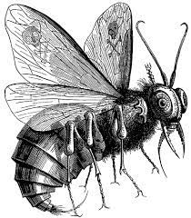
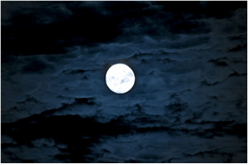

# [ 목차 ]

### 1. [게임명: Seven sins](#0)
### 2. [컨셉](#1)
### 3. [관련 동영상](#2)
### 4. [대표 이미지](#3)
### 5. [컨셉과 대표이미지 기반 작품 묘사](#3-1)
### 6. [Senven sins의 구성 요소](#4)
### 7. [게임 시스템 디자인](#5)
#### &nbsp;&nbsp;&nbsp;&nbsp; a. [게임 오브젝트 분해](#5-1)
#### &nbsp;&nbsp;&nbsp;&nbsp; b. [파라미터(속성)](#5-2)
#### &nbsp;&nbsp;&nbsp;&nbsp; c. [행동](#5-3)
#### &nbsp;&nbsp;&nbsp;&nbsp; d. [상태](#5-4)
#### &nbsp;&nbsp;&nbsp;&nbsp; e. [플레이어 캐릭터 속성(파라미터)](#5-5)
#### &nbsp;&nbsp;&nbsp;&nbsp; f. [게임의 규칙](#5-6)
#### &nbsp;&nbsp;&nbsp;&nbsp; g. [게임에서 사용될 공식](#5-7)
### 8. [개발 요구사항 & 흐름도](#6)
#### &nbsp;&nbsp;&nbsp;&nbsp; a. [요구사항(1년)](#6-1-1)
#### &nbsp;&nbsp;&nbsp;&nbsp; b. [요구사항(6주)](#6-1-2)
#### &nbsp;&nbsp;&nbsp;&nbsp; c. [키보드 이벤트에 대한 흐름도](#6-2)
### 9. [개발작업 일정(6주)](#7)

# 프로젝트명: seven sins (양승필) 
  

# [컨셉] 

## 메인컨셉 : 긴박함, 스릴

### 서브 컨셉 1 : 난이도

- (쉬운 난이도는 긴박함을 줄 수 없기 때문에 점차 쉽게 깨기 힘든 난이도로 설정해 긴박함을 준다 )

### 서브 컨셉 2 : 속도

- (느린 속도로는 긴박함을 주기 힘드므로 속도감을 빠르게해 보다 스릴있게 한다)

### 서브 컨셉 3 : 다양화

- (속도가 빠르더라도 동일한 패턴은 금방 익숙해지고 단조로워져 긴박함을 줄 수 없으므로 스테이지마다 공격방법과 적의 패턴을 다양화한다)

### 서브 컨셉 4 : 소리

- (긴장감 있는 배경음악과 상황에 맞는 효과음을 사용해 집중도를 높이고 효과음으로 적의 공격타이밍을 알 수 있게하여 긴장감을 높인다)

### 서브 컨셉 5 : 전략

- (스킬과 아이템을 전략적으로 선택해 사용하며 스릴있는 상황을 극복하는 쾌감을 준다 자신만의 플레이스타일로 선택해 플레이할 수도 있다 )

  

# [관련 이미지 & 동영상] 

- 이미지
    
- 동영상
  

  

# [대표 이미지] 

  

# [컨셉 & 대표이미지 기반 작품묘사] 

> ### 대표이미지 기반 :
(UI) 

- 적의 공격이 잘 보이도록 UI 최소화 예정 긴장감을 주기 위해 적의 체력 상황을 또한 보여주지 않습니다. 

- 좌측 상단에 캐릭터의 상태(아이템 보유현황)과 캐릭터의 게이지를 표시

(배경) 

- 각 칠죄종이 상징하는 상징물과 잘어울리는 배경

- 캐릭터가 오를 수 있는 블럭이 맵 곳곳에 배치
       
(적) 

- 각 칠죄종에 해당하는 상징물의 형태를 띄고 있음(예: 색욕=검은 가시에 얽매인 심장 )

(플레이어) 

- 위습 형태

- 획득 할 수 있는 아이템이 떨어짐

적이 스테이지당 하나씩 7개의 스테이지가 연속으로 있으며 적은 총 7개로 적마다 움직이는 패턴, 속도, 공격 패턴 등으로 차이점이 있습니다. 어설픈 난이도로는 스릴을 주기 힘들기 때문에 7개의 스테이지를 진행하면서 점차 쉽게 깰 수 없는 난이도의 속도 혹은 공격 패턴을 가지고 있습니다. 빠르게 움직이는 적의 공격에 캐릭터를 조종해 여러가지 방법들을 활용해 피하면서 움직이는 적에게 공격을 맞추어 스테이지를 클리어해 나갑니다.

  

# [<Seven sins> 구성 요소] 

 

## 1. 메커니즘

[도전 과제]

1. 적의 공격을 피하고 살아남아라
2. 제한시간 내에 적을 쓰러트리고 다음 스테이지로 나아가라
3. 7개의 적을 모두 물리쳐라

[재미 요소]

1. 캐릭터와 적 모두 빠른 속도감으로 스릴을 준다
2. 어려운 난이도의 긴박한 상황을 이겨내고 클리어 했을 때의 기쁨
3. 보스마다 다른 다양한 패턴
4. 악의 게이지를 조절하며 전략적인 플레이

 

## 2. 이야기

[만들게 된 배경]  
인간의 본성은 악일까 선일까 세계사 이래 인간이 발견한 모든 요소는 악용되지 않은 적이
없다고 한다. 예를 들어 불이 났을 때 자신의 안위를 위해 질서 없이 도망가는 일이 굉장히
흔하다. 질서를 잘 지키면서 차분하게 현장을 빠져나간다면 많은 사람들이 대피할 수 있다
는 걸 알고 있는데도 말이다.그 결과 다른 사람들이 압사하는 일이 생기더라도 그게 인간의
본성이기 때문이라는 것이다. 인간은 모두 이 게임처럼 악한 감정과 선한 감정의 줄다리기
가 아닐까 생각한다.

[카메라 관점]  
인간이 저지른 죄들로 인해 실망한 신은 선과 악 둘 중 무엇이 인간의 본질
인지 시험을 내린다. 한 사람을 만들어 인간이 죄를 저지르게 하는 감정 칠
죄종에 물든 인격과 대비되는 선함을 유발하는 감정 칠주선의 인격을 넣어
시험한다. 칠죄종의 인격이 주인공의 몸을 차지하기 위해 공격하자 칠주선
의 인격이 이를 막기 위해 이 이야기는 시작된다.
(교만 인색 질투 분노 음욕 탐욕 나태) 칠죄종
(겸손 자선 친절 인내 순결 절제 근면) 칠주선

 

## 3. 미적요소

[디자인][컬러]  
보스는 칠죄종의 각각의 상징물이다.
  
- 음욕 = 검은 가시에 얽매인 심장 
  
- 교만 = 검붉은 별 
  
- 질투 = 바다뱀이 휘감은 칼 
  
- 나태 = 담배 연기와 얼음 안개 
  
- 분노 = 검보라색 불꽃 
  
- 인색 = 파리 날개 위의 해골 
  
- 탐욕 = 돈자루 위의 깨진 십자기 
  
적의 공격과 캐릭터의 공격 또한 잘 보이도록 밝은 계열의 컬러를 사용하되, 정신없고 눈의 피로를 느끼게 할 수도 있어 채도와 명도를 낮춰 조절한다

[배경]
각 칠죄종이 상징하는 상징물과 잘어울리는 배경

[카메라]
전체 화면을 비추고 있어 플레이어가 한눈에 볼 수 있도록 함
  
UI를 최소화해 화면을 가리는 곳을 최소화

[음향] 
타격 시 타격감을 느끼도록 적절한 효과음과 긴장감을 유지해주는 BGM
  
캐릭터가 점프, 대쉬, 공격할 때 등에도 알맞은 효과음을 넣는다.
  
제한시간이 얼마 남지 않았다면 시계가 째깍거리는 소리가 나온다
  
 

## 4. 기술

유니티 URP 렌더 파이프라인 사용 빌트인 렌더 파이프라인과 차이가 미미하다면 빌트인 렌더 파이프라인 사용
  
그 외에 유니티 빌트인 기술 활용
  
# [게임 시스템 디자인] 

## a. 게임 오브젝트 분해 (구성 요소 분석) 

|연번|오브젝트 이름|오브젝트 이미지|
|:----:|:----:|:----:|
|1|wisp||
|2|lust||
|3|pride||
|4|Envy||
 
|연번|오브젝트 이름|오브젝트 이미지|
|:----:|:----:|:----:|
|5|Wrath||
|6|Sloth||
|7|Greed||
|8|Gluttony||
  
|연번|오브젝트 이름|오브젝트 이미지|
|:----:|:----:|:----:|
|9|shield||
|10|trap||
|11|gauge||
|12|Lust field||
  
|연번|오브젝트 이름|오브젝트 이미지|
|:----:|:----:|:----:|
|13|Pride field||
|14|Envy field||
|15|Wrath field||
|16|Sloth field||
  
|연번|오브젝트 이름|오브젝트 이미지|
|:----:|:----:|:----:|
|17|Greed field||
|18|Gluttony field||
|19|Block||
|20|gate||
## b. 파라미터(속성) 뽑아 보기 

1) 오브젝트 이름 : Wisp

|속성|영문명칭|설명|비고|
|:----:|:----:|:----:|:----:|
|게이지|Gauge|캐릭터의 게이지 수치||
|이동 스피드|Speed|캐릭터의 이동 속도||
|공격 속도|Loadspeed|캐릭터가 공격하고 다음공격하기 까지의 준비 속도||
|대쉬 속도|Dash speed|캐릭터의 대쉬 속도||
|점프 높이|Jump height|캐릭터의 점프 높이||
|상태|Status|캐릭터의 실드와 트랩 보유 상태||
|투사체 속도|AttSpeed|캐릭터가 공격하는 투사체의 속도||
|공격력|Damage|캐릭터의 공격력||

2) 오브젝트 이름 : Enemy

|속성|영문명칭|설명|비고|
|:----:|:----:|:----:|:----:|
|이동 스피드|E_Speed|적의 이동 스피드||
|체력|E_hp|적의 체력 수치||
|투사체 속도|E_AttSpeed|적이 공격하는 투사체의 속도||

3) 오브젝트 이름 : Sheild

|속성|영문명칭|설명|비고|
|:----:|:----:|:----:|:----:|
|지속 시간|Shieldtime|실드가 지속되는 시간||
|실드 횟수|Shieldcount|실드가 막는 공격횟수.||
|생성 시간|Createshield|실드 생성 시간||

4) 오브젝트 이름 : Trap

|속성|영문명칭|설명|비고|
|:----:|:----:|:----:|:----:|
|지속 시간|Traptime|트랩 지속시간||
|공격력|Trapdamage|트랩의 데미지||
|이동 제약|Crowdcontrol|트랩의 이동 제약||
|생성 시간|Createtrap|트랩 생성 시간||

5) 오브젝트 이름 : Gauge

|속성|영문명칭|설명|비고|
|:----:|:----:|:----:|:----:|
|충전 시간|Charge|게이지 충전시간||
|최대 충전량|Maxcharge|게이지 최대 충전량||

## c. 행동 뽑아 보기 

1) 오브젝트 이름 : Wisp

|행동|설명|
|:----:|:----:|
|이동|방향키로 이동한다,(← , →)|
|점프|점프키를 누르면 점프한다 점프하여 블록 위로 오를수도 있다|
|더블 점프|공중에서 점프키를 누르면 한번 더 점프한다|
|공격|플레이어의 체력이 1미만이 되면 캐릭터가 사망하고 게임오버된다|
|위 공격|위 방향키와 함께 공격키를 누르면 위로 공격한다|
|대쉬|대쉬키를 누르면 일정거리를 빠르게 이동한다 그 과정에서 부딪히는 적의 공격은 무시한다(무적판정)|
|함정 설치|함정을 설치한다|
|실드 사용|실드를 사용한다|
|스킬 사용|게이지를 소비해 스킬을 사용한다|

2) 오브젝트 이름 : Enemy

|행동|설명|
|:----:|:----:|
|공격|적이 투사체를 발사한다|
|이동|적이 공중에서 이동한다|
|특별 공격|일정 시간 후 특별 공격을 사용한다|
|사망|공격을받아 체력이 0이 되면 소멸한다|

3) 오브젝트 이름 : Trap

|행동|설명|
|:----:|:----:|
|공격|적에게 닿는다면 데미지를 준다|
|이동 제약|적에게 닿는다면 이동에 제약을 준다|

## d. 상태 뽑아 보기 

1) 오브젝트 이름 : Wisp

|현상태|전이상태|전이조건|
|:----:|:----:|:----:|
|대기|이동(→ , ←)|이동키 버튼 클릭|
|대기 or 이동|점프|점프키 버튼 클릭|
|점프|더블점프|공중에서 점프키 한번더 클릭|
|대기 or 이동 or 점프|공격|공격 버튼 클릭|
|대기 or 이동 or 점프|위 공격|위방향키와 공격버튼 함께 클릭|
|대기 or 이동 or 점프|대쉬|대쉬 버튼 클릭|
|모든 상태|함정 획득|함정 아이템 획득|
|함정 획득|함정 설치|함정 설치 버튼 클릭|
|대기|실드 생성|실드 아이템 획득|
|모든 상태|무적 상태|게이지를 소비해 스킬 사용|
|모든 상태|죽음|일정 시간 안에 적을 쓰러트리지 못하거나 적의 공격에 맞는 경우|

2) 오브젝트 이름 : Enemy

|현상태|전이상태|전이조건|
|:----:|:----:|:----:|
|대기|이동|조건 없이 정해진대로 움직임|
|모든 상태|공격|조건없이 정해진대로 공격|
|모든 상태|특별 공격|일정 시간후 공격|
|모든 상태|죽음|일정 시간 안에 hp가 0이 될 경우|
|모든 상태|이동 제약|이동 제약 함정에 닿을 경우|

3) 오브젝트 이름 : Shield

|현상태|전이상태|전이조건|
|:----:|:----:|:----:|
|비활성화|활성화|캐릭터가 실드 아이템 획득|
|활성화|비활성화|일정 시간이 지나거나 적의 공격에 맞을 경우|

4) 오브젝트 이름 : Trap

|현상태|전이상태|전이조건|
|:----:|:----:|:----:|
|비활성화|활성화|캐릭터가 함정 설치|
|활성화|비활성화|일정 시간이 지나거나 적에게 닿을 경우|
  
5) 오브젝트 이름 : Gauge

|현상태|전이상태|전이조건|
|:----:|:----:|:----:|
|비활성화|활성화|시간이 지남에 따라 게이지 충전|
|활성화|비활성화|게이지를 소비해 스킬 사용|
  
6) 오브젝트 이름 : Gate

|현상태|전이상태|전이조건|
|:----:|:----:|:----:|
|비활성화|활성화|적을 쓰러트리고 스테이지 클리어시 생성|

## e. 플레이어 캐릭터 속성(파라미터) 

|속성|영문명칭|설명|비고|
|:----:|:----:|:----:|:----:|
|게이지|Gauge|캐릭터의 게이지 수치||
|이동 스피드|Speed|캐릭터의 이동 속도||
|대쉬 속도|Dash speed|캐릭터의 대쉬 속도||
|점프 높이|Jump height|캐릭터의 점프 높이||
|상태|Status|캐릭터의 실드와 트랩 보유 상태||
|투사체 속도|AttSpeed|캐릭터가 공격하는 투사체의 속도||
|공격력|Damage|캐릭터의 공격력||

## f. 게임의 규칙 

1) 핵심 규칙
  
▷ 총 7개의 스테이지로 구성되어 있으며 각 스테이지마다 있는 하나의 적을 제한시간 내에 쓰러트려야 다음 스테이지로 넘어갈 수 있다.
  
▷ 제한시간 안에 적을 쓰러트린다면 게이트가 나타나 다음 스테이지로 넘어갈 수 있다
  
▷ 제한시간 안에 쓰러트리지 못하거나 적의 공격에 맞는다면 패배한다
  
▷ 7개의 스테이지를 모두 클리어하면 승리한다

2) 보조 규칙
  
▷ 공격, 대쉬는 사용 후 쿨타임을 갖게 되어 바로 재사용이 불가능하다
  
▷ 공중에서 한번만 더 점프할 수 있
  
▷ 일정 시간마다 실드와 함정아이템이 떨어진다 
  
▷ 함정과 실드는 일회성이며 영원히 지속되는 것이 아닌 일정 시간 후 사라진다
  
▷ 시간이 지남에 따라 쌓이는 게이지를 소비해 일정 시간동안 적의 공격을 모두 회피하는 스킬을 사용할 수 있다

     
## g. 게임에서 사용될 공식 

1. 제한시간 – 진행시간(Timescale)의 값(result)을 구한다

-  result의 값이 0보다 작다면 시간 초과로 패배한다
  
2. 적의 최대 체력 – 플레이어의 공격 데미지 = 적의 현재 체력
  
-  적의 현재 체력이 0보다 같거나 작다면 적 사망
  
-  게이트 생성, 다음 스테이지 이동 가능
  
3. 현재 게이지의 양 > 소비되는 게이지의 양
  
- 스킬 사용
  
  
   
   
     
# [개발 요구사항 & 흐름도] 

## a. 요구사항(1년) 

  ### 그래픽
  
  ▶ 7개의 적인 칠죄종을 각각의 상징물에 맞는 이미지로 만든다
  
 - 음욕 = 검은 가시에 얽매인 심장 
  
 - 교만 = 검붉은 별 
  
 - 질투 = 바다뱀이 휘감은 칼 
  
 - 나태 = 담배 연기와 얼음 안개 
  
 - 분노 = 검보라색 불꽃 
  
 - 인색 = 파리 날개 위의 해골 
  
 - 탐욕 = 돈자루 위의 깨진 십자기 
  
 - 피격시와 죽을 때, 특별 공격시 이펙트 추가
  
  적은 구체의 투사체로 공격
  
   
  
    
  
  ▶ 배경은 상징물에 어울리는 배경을 만든다
  
 - 음욕 = 많은 가시에 얽혀 가시들에게 빨려가는 느낌을 주는 배경 
  
 - 교만 = 어두운 하늘에 하얀 달이 떠있는 배경
  
 - 질투 = 뱀들이 기어다니는 배경 
  
 - 나태 = 자욱한 연기속에 있는 느낌을 주는 배경 
  
 - 분노 = 활활 타고있는 느낌을 주는 배경
  
 - 인색 = 아지랑이 느낌의 몽환적인 느낌을 주는 배경
  
 - 탐욕 = 황금동전이 쌓여있는 배경
  
    
 
  ▶ 화면
  
 - 시작화면, 키 안내 화면, 게임화면, 결과화면 4개의 화면
 
 - 시작화면은 어두운 배경에 문이 하나 있고 그곳에서 빛이나오는 화면
  
 - 키 안내 화면에는 사용하는 키보드 키와 그에대한 설명
  
 - 결과화면은 게임오버 화면과 클리어 화면
  
    
  
  ▶ 플레이어
  
 - 기본적으로 시작 시 플레이어는 왼쪽에 적은 오른쪽에 위치
  
 - 캐릭터는 빛나는 위습형태로 마법 모양의 투사체를 날리는 원거리 공격
  
  
 
 - 실드와 함정이 위에서 아래로 떨어지며 실드가 플레이어에 닿으면 캐릭터 주위를 배리어로 감싸고 사라지며 플레이어의 상태UI 변경, 함정은 다이너마이트 형태와 가시 형태 두가지로 마찬가지로 플레이어에 닿으면 사라지며 좌측 상단의 플레이어의 상태UI가 변경
  
 - 플레이어가 함정 설치 버튼을 클릭하는 위치에 함정 생성 후 좌측 상단의 플레이어의 상태UI 변경
  
 - 다이너마이트 함정은 활성화시 터지는 이펙트, 가시 함정은 튀어나와 적을 찌르는 이펙트
  
 - 대쉬를 사용하면 일정거리를 빠르게 움직이는 이펙트
  
 - 게이지 좌측 상단에 게이지의 상태를 보여주는 UI가 위치 시간이 지남에 따라 자동으로 충전
  
 - 게이지를 소모하고 스킬 사용시 좌측 상단의 게이지가 줄어들며 캐릭터에도 이펙트 효과
  
 - 맵 곳곳에 블럭을 위치한다
  
 - 스테이지가 클리어되면 게이트 나타남
  
    
  
  ＃프로그래밍
  
  ▶ 화면
  
  - 시작화면에서 클릭하면 키 안내화면으로 변경되며 한번더 클릭하면 게임화면으로 변경
  
  - 플레이어가 실드가 없는 상태로 공격을 맞는다면 패배 결과화면으로 변경
  
  - 제한시간 내에 스테이지를 클리어하지 못한다면 패배 결과화면으로 변경
  
  - 스테이지 클리어시 게이트가 생성되며 플레이어에 닿으면 다음 스테이지로 변경
  
  - 7개의 스테이지를 모두 클리어하면 승리 결과화면으로 변경
  
    
  
  ▶ 플레이어 캐릭터
  
  - 방향키로 좌우로 움직이며, 스페이스바로 점프, x키로 대쉬, z로 공격, 위방향키와 z키로 위공격, c키로 함정설치, 왼쪽컨트롤키로 스킬을 사용 
  
  - 공격키를 누르면 플레이어 앞에 공격 오브젝트가 생성되어 날라가며 적에게 닿으면 사라지며 데미지를 줌, 위 방향키와 함께 공격키를 누를시 위 방향으로 공격
  
  - x키를 누르면 잠시 무적상태로 일정거리를 빠르게 대쉬
  
  - 공격, 대쉬는 사용 후 쿨타임을 갖게 되어 바로 재사용이 불가능
  
  - 스페이스바를 누르면 점프를 하며 최대 연속 점프 횟수는 두번
  
  - 실드와 함정이 일정시간마다 위에서 아래로 떨어지며 플레이어에 닿으면 획득되며 사라짐
  
  - 실드가 있는 상태에서 공격을 맞는다면 실드 소멸
  
  - 실드가 없는 상태에서 공격을 맞는다면 패배 결과화면 생성
  
  - 플레이어가 함정을 가지고 있다면 c키를 누른 위치에 함정 설치
  
  - c키를 누르면 게이지를 소비하여 스킬 사용
  
  - 스테이지 클리어시 게이트가 생성되며 플레이어에 닿으면 다음 스테이지로 변경
  
    
  
  ▶ 적
  
  - 공중에서 떠 다니며 정해진 움직임대로 이동
  
  - 구체의 투사체를 여러 각도로 발사하며 공격
  
  - 일정 시간 후 특별 공격 사용
  
 ▷ 음욕 =  
  
 ▷ 교만 = 
  
 ▷질투 = 
  
 ▷나태 = 
  
 ▷분노 = 
  
 ▷인색 =  
  
 ▷탐욕 = 
  
 - 플레이어의 공격을 일정 횟수 맞으면 파괴
  
    
  
  ▶ 블록
  
  - 플레이어가 블록을 밟고 있을 수 있음
  
  - 캐릭터가 점프하면서 블록을 올라갈 때에는 통과
  
  ▶ 실드
  
  - 일정 시간마다 실드 드랍
  
  - 적의 공격을 대신 맞아주고 소멸
  
  - 실드는 일회성이며 일정시간 사용되지 않는다면 소멸
  
  ▶ 트랩
  
  - 일정 시간마다 함정아이템이 드랍
  
  - 함정은 일회성이며 일정시간 사용되지 않는다면 소멸
  
  - 다이너마이트 함정 = 큰 데미지, 가시 함정 = 적의 이동에 제약
  
  - 적에게 닿으면 활성화, 이후 사라짐
  
  ▶ 스킬
  
  - 게이지를 10 소비해 스킬 사용
  
  - 시간이 지남에 따라 게이지가 자동으로 충전
  
  - 스킬 사용시 3초동안 무적 효과
